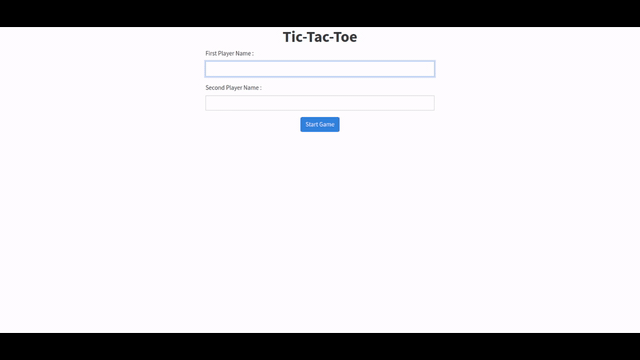

# Tic-Tac-Toe

a simple Tic-Tac-Toe game useing html and js .

[Click To Check The Project Details](https://www.theodinproject.com/courses/javascript/lessons/tic-tac-toe-javascript)

## Authors

This project was executed by the duo of :

- [Mohamed Naser](https://www.linkedin.com/in/mohamednaseramein/)

## Used Tools

- HTML
- CSS
- JavaScript
- MarkDown Syntax

## Done Work

- [x] Create Players form .
- [x] build game design.
- [x] build game logic.

## Setup

Open your git bash and cd to the location you'd like to put your files the run the command below.

```console
git clone https://github.com/mohamednaser/Tic-Tac-Toe.git
```

## Live Version

Live version [here](https://mohamednaser.github.io/Tic-Tac-Toe/).

## ScreenShots


